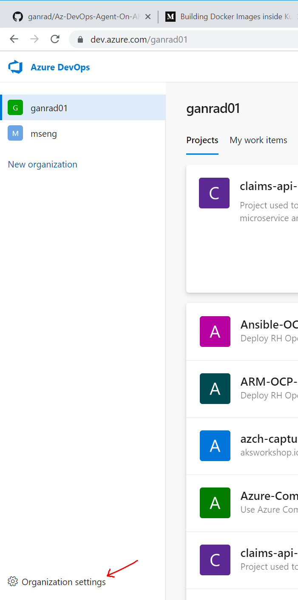
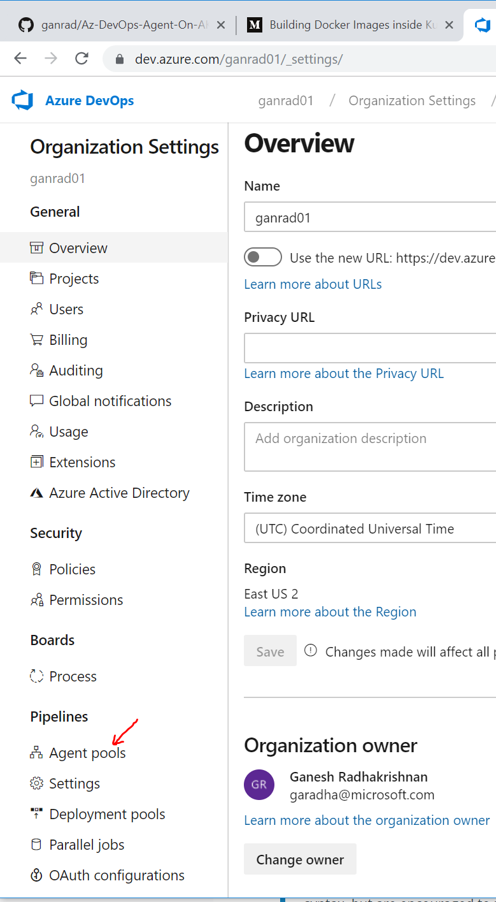
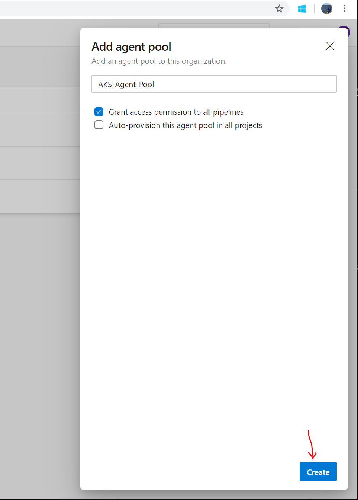
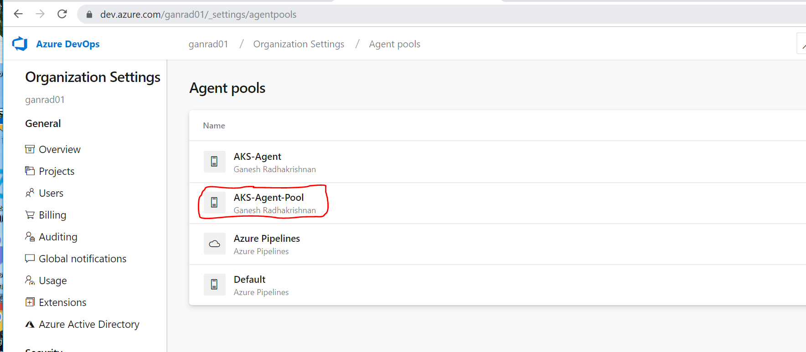

# Build and deploy the Azure DevOps Pipeline Agent on AKS

### A] Create PAT token and Agent Pool in Azure DevOps Services
1. Login to Azure DevOps Services portal with your credentials

2. Create a *PAT* token
   Click on your profile name (top right corner) and then click on **Security**.  Click on **+ New Token**. See screenshot below.

   

   In the *Create a personal access token* window, specify a name for the PAT Token, set the **Expiration** field to **Custom defined** and select an expiry date.  Set the **Scopes** field to **Full access**.  Then click on **Create**.  See screenshot below.

   

   Copy and save the PAT token.  The token won't be accessible once the window is closed.

   

2. Create an *Agent Pool*
   Open up the Azure DevOps organization tab and then click on **Organization settings** (lower left corner).  See screenshot below.   

   

   Then click on **Agent pools* as shown in the screenshot below.

   

   Click on **Add pool**, specify a name for the agent pool and check the box for **Grant access permission to all pipelines**.  Click on **Create**.  See screenshots below.

   

   

### B] Build Azure DevOps Pipeline Agent and push it to Azure Container Registry (ACR)
1. Refer to [Azure DevOps docs](https://docs.microsoft.com/en-us/azure/devops/pipelines/agents/docker?view=azure-devops) and follow the steps to copy the `Dockerfile` and `start.sh` scripts to a local VM with **docker** engine installed on it.  These files are also provided in the `./dockeragent` directory.

2. Build the Azure DevOps Pipeline agent

   ```
   #
   $ docker build -t azdevopsagent:latest .
   #
   # List the docker images
   $ docker images
   #
   ```

3. Push the Azure DevOps Pipeline Agent container image to ACR

   ```
   # NOTE: Substitute the correct value for ACR ('<acrName>') in the commands below
   #
   # Login to ACR with your credentials.
   $ az acr login --name <acrName>
   #
   # Tag the Azure DevOps Pipeline image 
   $ docker tag azdevopsagent:latest <acrName>.azurecr.io/azdevopsagent:v1
   #
   # List the docker images
   $ docker images
   #
   # Push the image to ACR
   $ docker push <acrName>.azurecr.io/azdevopsagent:v1
   #
   # List the images in the ACR repository
   $ az acr repository list --name <acrName> -o table
   #
   # List the tags in the 'azdevopsagent' repository
   $ az acr repository show-tags --name <acrName> --repository azdevopsagent -o table
   #
   ```

### C] Test the Azure DevOps Pipeline Agent on a local VM
1. Run the Azure DevOps Pipeline Agent
   
   ```
   #
   # Provide correct values for the following parameters
   #
   # AZP_URL = Azure DevOps URL eg., https://dev.azure.com/org
   # AZP_TOKEN = Azure DevOps PAT Token
   # AZP_AGENT_NAME = Any meaningful name for the container agent
   # AZP_POOL = Name of the agent pool registered in Azure DevOps Services.  Default value is 'Default' pool
   #
   # Use docker bind mount for running docker builds within the docker agent container! Add the '-v' option as below.
   # -v /var/run/docker.sock:/var/run/docker.sock
   #
   $ docker run -e AZP_URL="<Azure DevOps URL>" -e AZP_TOKEN="<Azure DevOps PAT Token>" -e AZP_AGENT_NAME="Az-DevOps-Agent" -e AZP_POOL="<Azure DevOps Agent Pool name>" azdevopsagent:latest
   #
   ```

2. Verify the agent has registered with the correct pool in Azure DevOps Services

   Login to Azure DevOps Services Portal with your credentials.  Click on **Organization Settings** and then click on **Agent pools**.  See screenshot below.

   

   From the agent pool list, select the pool the agent is connected to.

   

   Click on the **Agents** tab and make sure the agent is online.  See screenshot below. 

   
